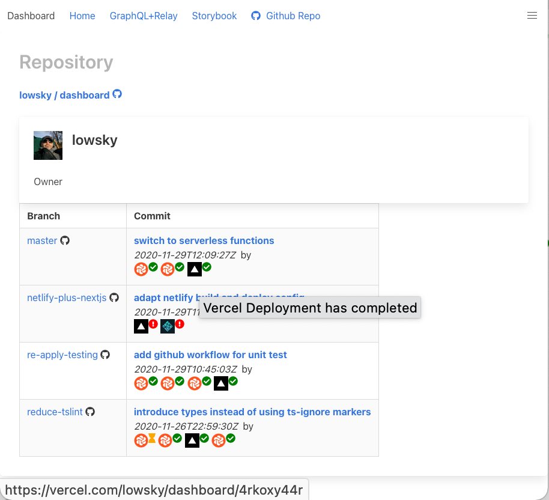

[](https://snyk.io/test/github/lowsky/dashboard)


## Stack

-   GraphQL
-   Next.js
-   Netlify/Vercel
-   ~ApolloServer~ Helix, Envelop
-   Relay.js
-   ChakraUI ~Builma~
-   React
-   Storybook
-   ~Chromatic~
-   Typescript
-   Jest
-   Storyshots

## Purpose

List the `(feature) branches` of a GitHub repository with its

-   last commit's build status
-   last commit's linked PR
-   last commit's commit message

The idea behind this was, to provide easy access to all feature branches before releasing them.
So you can test a new version of a new feature before bringing it live.

Very old presentation at a Docker Meetup: Find the [slides here](https://github.com/lowsky/dockerMeetupSlides)

## Getting started

After invoking this in a shell

    git clone https://github.com/lowsky/dashboard
    cd dashboard

    # Install the dependencies of the react app and
    # installs the server's dependencies, too:
    yarn

then set up the `github-token` (see [Setup GitHub Token](#setupgithubtoken) ) before starting local dev mode via:

    yarn dev

This runs Next.js dev-mode which includes the endpoints for the graphql API.

Open the home [http://localhost:3000](http://localhost:3000) with your browser.

Or **even better** the dashboard project page: [http://localhost:3000/relay/lowsky/dashboard](http://localhost:3000/relay/lowsky/dashboard)

### Built-in GraphQL-backend

**GraphIql Playground:** [http://localhost:3000/api/graphql](http://localhost:3000/api/graphql)

for using and playing with different graphql queries, e.g.:
(use this [link with query](http://localhost:3000/api/graphql?query=%7B%0A%20%20github%20%7B%0A%20%20%20%20user%28username%3A%20%22lowsky%22%29%20%7B%0A%20%20%20%20%20%20login%0A%20%20%20%20%20%20avatar_url%0A%20%20%20%20%7D%0A%20%20%20%20repo%28ownerUsername%3A%20%22lowsky%22%2C%20name%3A%20%22dashboard%22%29%20%7B%0A%20%20%20%20%20%20name%0A%20%20%20%20%20%20branches%7Bname%7D%0A%20%20%20%20%7D%0A%20%20%7D%0A%7D%0A)

```graphql
{
    github {
        user(username: "lowsky") {
            login
            avatar_url
        }
        repo(ownerUsername: "lowsky", name: "dashboard") {
            name
            branches {
                name
            }
        }
    }
}
```

Have fun!

### setupGithubToken

You **need to create your own github-token** (see https://github.com/settings/tokens/) and
store it locally in `.env` file

    # create an .env file with this content ...

GITHUB_TOKEN=XXX

    # ... and replace the XXX with your API key
    # typically something like ghp_....

## ScreenShot



# Background

This project was used to figure out and to demonstrate, how to develop a frontend UI with Facebook's _Relay_ and _GraphQL_ libraries.

For deep interns of GraphQL concepts, see the [presentation at the EnterJS Conference 2016](https://lowsky.github.io/deck-graphql-relay-talk) with its [slide sources](https://www.github.com/lowsky/deck-graphql-relay-talk)

## License

Licensed under the Apache License 2.0, Copyright ©️ 2018 Robert Hostlowsky. See [LICENSE](LICENSE) for more information.
